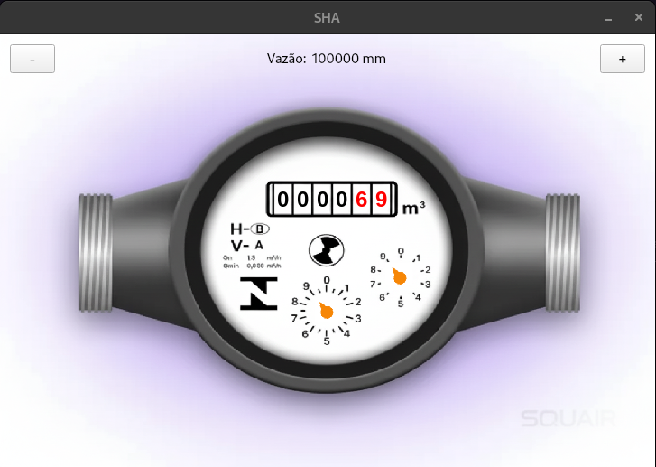
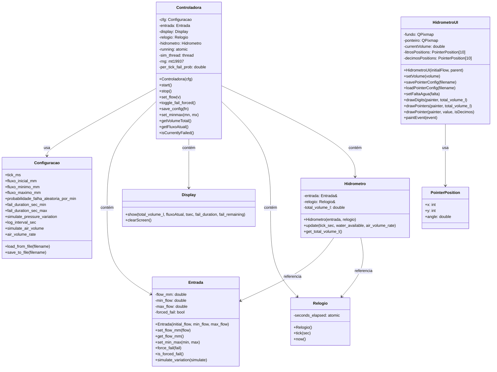

## Simulador de Hidrometro
 

Projeto para a disciplina de Padrões de Projeto do curso de Engenharia de Computação do IFPB Campus Campina Grande.

O projeto simula um hidrômetro, desenvolvido em C++, onde simula o consumo de água tentando se aproximar da realidade. O usuário pode realizar a configuração do simulador para tentar se aproximar de uma situação desejada.

## Diagrama de Classe
