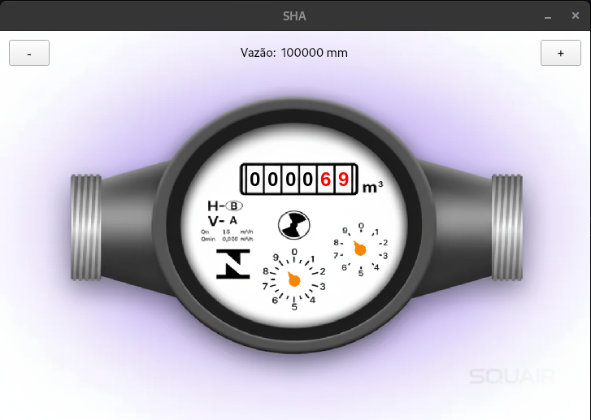
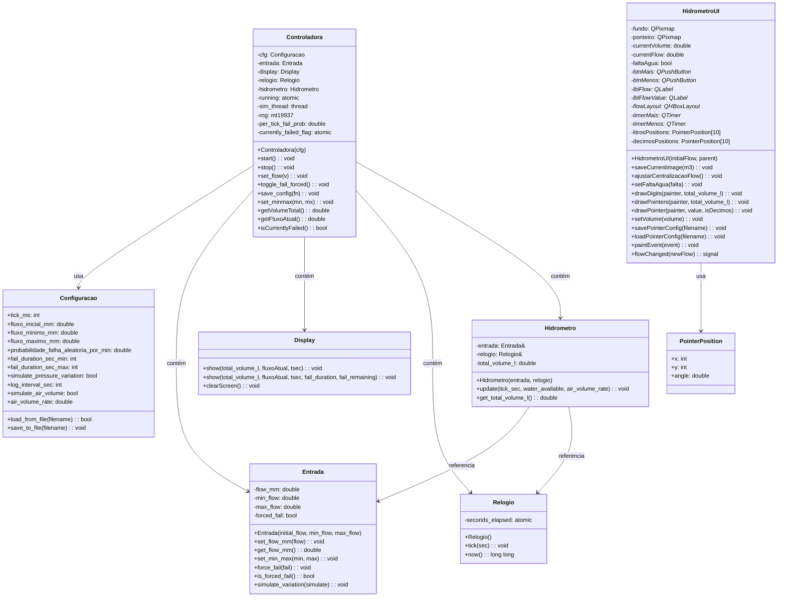

## Simulador de Hidrometro
 

Projeto para a disciplina de Padrões de Projeto do curso de Engenharia de Computação do IFPB Campus Campina Grande.

O projeto simula um hidrômetro, desenvolvido em C++, onde simula o consumo de água tentando se aproximar da realidade. O usuário pode realizar a configuração do simulador para tentar se aproximar de uma situação desejada.

## Diagrama de Classe

```mermaid
classDiagram
    class Configuracao {
        +tick_ms: int
        +fluxo_inicial_mm: double
        +fluxo_minimo_mm: double
        +fluxo_maximo_mm: double
        +probabilidade_falha_aleatoria_por_min: double
        +fail_duration_sec_min: int
        +fail_duration_sec_max: int
        +simulate_pressure_variation: bool
        +log_interval_sec: int
        +simulate_air_volume: bool
        +air_volume_rate: double
        +load_from_file(filename): bool
        +save_to_file(filename): void
    }

    class Controladora {
        -cfg: Configuracao
        -entrada: Entrada
        -display: Display
        -relogio: Relogio
        -hidrometro: Hidrometro
        -running: atomic<bool>
        -sim_thread: thread
        -rng: mt19937
        -per_tick_fail_prob: double
        -currently_failed_flag: atomic<bool>
        +Controladora(cfg)
        +start(): void
        +stop(): void
        +set_flow(v): void
        +toggle_fail_forced(): void
        +save_config(fn): void
        +set_minmax(mn, mx): void
        +getVolumeTotal(): double
        +getFluxoAtual(): double
        +isCurrentlyFailed(): bool
    }

    class Display {
        +show(total_volume_l, fluxoAtual, tsec): void
        +show(total_volume_l, fluxoAtual, tsec, fail_duration, fail_remaining): void
        +clearScreen(): void
    }

    class Entrada {
        -flow_mm: double
        -min_flow: double
        -max_flow: double
        -forced_fail: bool
        +Entrada(initial_flow, min_flow, max_flow)
        +set_flow_mm(flow): void
        +get_flow_mm(): double
        +set_min_max(min, max): void
        +force_fail(fail): void
        +is_forced_fail(): bool
        +simulate_variation(simulate): void
    }

    class Hidrometro {
        -entrada: Entrada&
        -relogio: Relogio&
        -total_volume_l: double
        +Hidrometro(entrada, relogio)
        +update(tick_sec, water_available, air_volume_rate): void
        +get_total_volume_l(): double
    }

    class Relogio {
        -seconds_elapsed: atomic<long long>
        +Relogio()
        +tick(sec): void
        +now(): long long
    }

    class HidrometroUI {
        -fundo: QPixmap
        -ponteiro: QPixmap
        -currentVolume: double
        -currentFlow: double
        -faltaAgua: bool
        -btnMais: QPushButton*
        -btnMenos: QPushButton*
        -lblFlow: QLabel*
        -lblFlowValue: QLabel*
        -flowLayout: QHBoxLayout*
        -timerMais: QTimer*
        -timerMenos: QTimer*
        -litrosPositions: PointerPosition[10]
        -decimosPositions: PointerPosition[10]
        +HidrometroUI(initialFlow, parent)
        +saveCurrentImage(m3): void
        +ajustarCentralizacaoFlow(): void
        +setFaltaAgua(falta): void
        +drawDigits(painter, total_volume_l): void
        +drawPointers(painter, total_volume_l): void
        +drawPointer(painter, value, isDecimos): void
        +setVolume(volume): void
        +savePointerConfig(filename): void
        +loadPointerConfig(filename): void
        +paintEvent(event): void
        +flowChanged(newFlow): signal
    }

    class PointerPosition {
        +x: int
        +y: int
        +angle: double
    }

    %% Relacionamentos
    Controladora --> Configuracao : usa
    Controladora --> Entrada : contém
    Controladora --> Display : contém
    Controladora --> Relogio : contém
    Controladora --> Hidrometro : contém

    Hidrometro --> Entrada : referencia
    Hidrometro --> Relogio : referencia

    HidrometroUI --> PointerPosition : usa
```

## Manutençao do SHA V2

### Uso de `std::unique_ptr`

Para resolver problemas relacionados à cópia e movimentação de objetos, o código foi atualizado para utilizar `std::unique_ptr` no armazenamento de objetos `Controladora` e `HidrometroUI`. Isso garante que os objetos sejam gerenciados corretamente na memória e evita erros de compilação relacionados a construtores de cópia ou movimentação deletados.

### Como Usar

1. Certifique-se de que o Qt5 está instalado no sistema e que os caminhos para os cabeçalhos e bibliotecas estão configurados corretamente no `Makefile`.
2. Compile o projeto utilizando o comando:
   ```bash
   make
   ```
3. Execute o simulador com o comando:
   ```bash
   ./hidrometro_sim [número_de_threads]
   ```
   - Substitua `[número_de_threads]` pelo número desejado de threads para simular múltiplos hidrômetros simultaneamente.

### Benefícios das Alterações
- Melhor gerenciamento de memória com `std::unique_ptr`.
- Resolução de problemas de compilação relacionados a classes que não possuem construtores de cópia ou movimentação válidos.